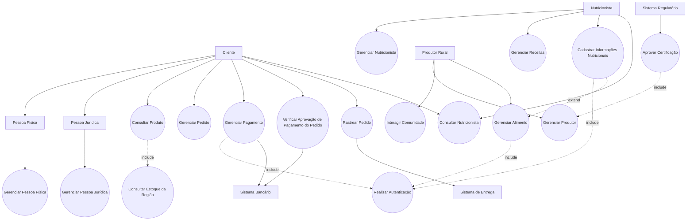
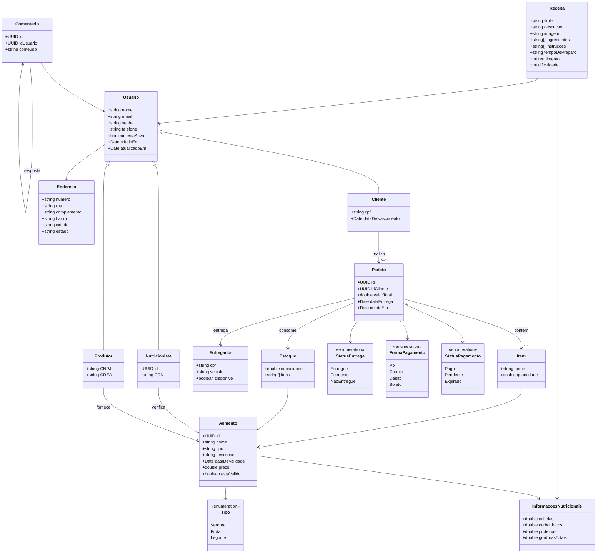

<strong>Diagrama Conceitual</strong>

```mermaid
flowchart TB
    Cliente["Cliente"] --> PessoaFisica["Pessoa Física"] & PessoaJuridica["Pessoa Jurídica"] & ConsultarProduto(("Consultar Produto")) & GerenciarPedido(("Gerenciar Pedido")) & GerenciarPagamento(("Gerenciar Pagamento")) & VerificarPagamento(("Verificar Aprovação de Pagamento do Pedido")) & RastrearPedido(("Rastrear Pedido")) & ConsultarNutricionista(("Consultar Nutricionista"))
    PessoaFisica --> GerenciarPF(("Gerenciar Pessoa Física"))
    PessoaJuridica --> GerenciarPJ(("Gerenciar Pessoa Jurídica"))
    ConsultarProduto -. include .-> ConsultarEstoque(("Consultar Estoque da Região"))
    GerenciarPagamento -. include .-> Autenticacao(("Realizar Autenticação"))
    GerenciarAlimento(("Gerenciar Alimento")) -. include .-> Autenticacao
    CadastrarInfoNutricional(("Cadastrar Informações Nutricionais")) -. include .-> Autenticacao
    CadastrarInfoNutricional -. extend .-> GerenciarAlimento
    GerenciarPagamento --> SistemaBancario["Sistema Bancário"]
    VerificarPagamento --> SistemaBancario
    RastrearPedido --> SistemaEntrega["Sistema de Entrega"]
    Produtor["Produtor Rural"] --> GerenciarProdutor(("Gerenciar Produtor")) & InteragirComunidade(("Interagir Comunidade")) & GerenciarAlimento
    SistemaRegulatorio["Sistema Regulatório"] --> AprovarCertificacao(("Aprovar Certificação"))
    AprovarCertificacao -. include .-> GerenciarProdutor
    Nutricionista["Nutricionista"] --> GerenciarNutricionista(("Gerenciar Nutricionista")) & GerenciarReceitas(("Gerenciar Receitas")) & CadastrarInfoNutricional & ConsultarNutricionista
```
 

---
 

<strong>Diagrama de Classes</strong>

```mermaid
classDiagram

%% ===================== CLASSES =====================

class Usuario {
  +string nome
  +string email
  +string senha
  +string telefone
  +boolean estaAtivo
  +Date criadoEm
  +Date atualizadoEm
}

class Cliente {
  +string cpf
  +Date dataDeNascimento
}

class Nutricionista {
  +UUID id
  +string CRN
}

class Produtor {
  +string CNPJ
  +string CREA
}

class Endereco {
  +string numero
  +string rua
  +string complemento
  +string bairro
  +string cidade
  +string estado
}

class Pedido {
  +UUID id
  +UUID idCliente
  +double valorTotal
  +Date dataEntrega
  +Date criadoEm
}

class Item {
  +string nome
  +double quantidade
}

class Alimento {
  +UUID id
  +string nome
  +string tipo
  +string descricao
  +Date dataDeValidade
  +double preco
  +boolean estaValido
}

class Estoque {
  +double capacidade
  +string[] itens
}

class InformacoesNutricionais {
  +double calorias
  +double carboidratos
  +double proteinas
  +double gordurasTotais
}

class Receita {
  +string titulo
  +string descricao
  +string imagem
  +string[] ingredientes
  +string[] instrucoes
  +string tempoDePreparo
  +int rendimento
  +int dificuldade
}

class Comentario {
  +UUID id
  +UUID idUsuario
  +string conteudo
}

class Entregador {
  +string cpf
  +string veiculo
  +boolean disponivel
}

%% ===================== ENUMS =====================

class StatusPagamento {
  <<enumeration>>
  Pago
  Pendente
  Expirado
}

class FormaPagamento {
  <<enumeration>>
  Pix
  Credito
  Debito
  Boleto
}

class StatusEntrega {
  <<enumeration>>
  Entregue
  Pendente
  NaoEntregue
}

class Tipo {
  <<enumeration>>
  Verdura
  Fruta
  Legume
}

%% ===================== HERANÇA =====================

Usuario <|-- Cliente
Usuario <|-- Nutricionista
Usuario <|-- Produtor

%% ===================== RELACIONAMENTOS =====================

Cliente "1" --> "0..*" Pedido : realiza
Pedido "1" --> "1..*" Item : contem
Item --> Alimento

Pedido --> StatusPagamento
Pedido --> FormaPagamento
Pedido --> StatusEntrega

Pedido --> Estoque : consome
Estoque --> Alimento

Produtor --> Alimento : fornece
Nutricionista --> Alimento : verifica

Alimento --> InformacoesNutricionais
Alimento --> Tipo

Usuario --> Endereco

Receita --> InformacoesNutricionais
Receita --> Usuario

Comentario --> Usuario
Comentario --> Comentario : resposta

Pedido --> Entregador : entrega
```